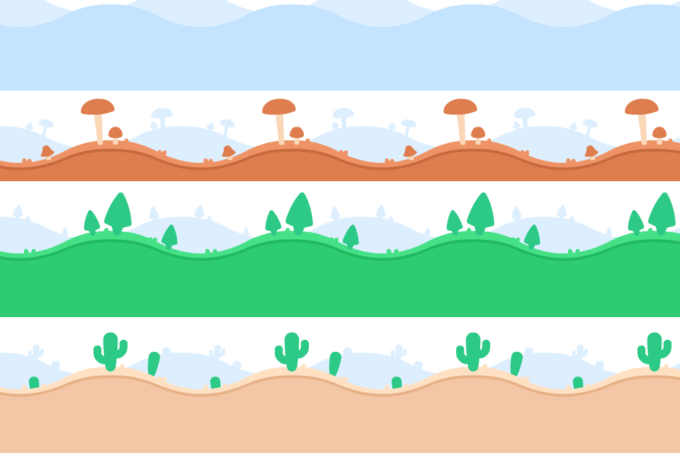

# Qt Programming 2025 游戏项目



## 项目简介

这是一个基于 Qt6 和 C++ 开发的2D游戏项目，使用了 Qt Graphics Framework 来构建游戏场景和渲染系统。

### 🎮 游戏特色
- 🔥 **实时双人对战**: 支持本地双人对战模式
- ⚔️ **丰富武器系统**: 5种不同类型武器，各具特色
- 🎯 **动态武器掉落**: 武器从天空随机掉落，增加游戏策略性
- 🏃‍♂️ **流畅物理引擎**: 重力、碰撞检测、平台跳跃

## 技术栈

- **编程语言**: C++17
- **GUI框架**: Qt6 (Core, Gui, Widgets)
- **构建系统**: CMake 3.28+
- **图形渲染**: QGraphicsView/QGraphicsScene

## 项目结构

```
├── src/                    # 源代码目录
│   ├── main.cpp           # 程序入口点
│   ├── MyGame.h/cpp       # 主游戏窗口类
│   ├── Items/             # 游戏物品系统
│   │   ├── Item.h/cpp     # 基础物品类
│   │   ├── Pickable.h/cpp # 可拾取物品基类
│   │   ├── Mountable.h/cpp # 可装备物品基类
│   │   ├── PickupManager.h/cpp # 统一拾取管理器
│   │   ├── Characters/    # 角色相关
│   │   │   ├── Character.h/cpp # 基础角色类
│   │   │   ├── BuffSystem.h    # 增益效果系统
│   │   │   └── Green.h/cpp     # Green角色
│   │   ├── Weapons/       # 武器系统
│   │   │   ├── Weapon.h/cpp          # 武器基类
│   │   │   ├── WeaponManager.h/cpp   # 武器管理器
│   │   │   ├── MeleeWeapon.h/cpp     # 近战武器基类
│   │   │   ├── RangedWeapon.h/cpp    # 远程武器基类
│   │   │   ├── Projectile.h/cpp      # 投射物基类
│   │   │   ├── Fist.h/cpp            # 拳头(默认武器)
│   │   │   ├── Sword.h/cpp           # 剑
│   │   │   ├── ThrowingStone.h/cpp   # 投掷石头
│   │   │   ├── Raygun.h/cpp          # 激光枪
│   │   │   └── RaygunBig.h/cpp       # 大型激光枪
│   │   ├── Medicine/      # 药物系统
│   │   │   ├── Medicine.h/cpp        # 药物基类
│   │   │   ├── MedicineManager.h/cpp # 药物管理器
│   │   │   ├── HealthPotion.h/cpp    # 健康药水
│   │   │   ├── MagicPotion.h/cpp     # 魔法药水
│   │   │   └── EnergyBoost.h/cpp     # 能量增益药水
│   │   └── Maps/          # 地图相关
│   │       ├── Map.h/cpp             # 地图基类
│   │       └── Battlefield.h/cpp     # 战场地图
│   ├── Physics/           # 物理系统
│   │   └── PhysicsConstants.h        # 物理常量
│   └── Scenes/            # 游戏场景
│       ├── Scene.h/cpp    # 基础场景类
│       ├── BattleScene.h/cpp         # 战斗场景
│       └── ChooseBattlefieldScene.h/cpp # 地图选择场景
├── assets/                # 游戏资源
│   ├── assets.qrc        # Qt资源文件
│   └── Items/            # 物品贴图资源
│       ├── Weapons/      # 武器贴图
│       └── Medicine/     # 药物贴图
└── build/                # 构建输出目录
```

## 功能特性

### 已实现功能
- ✅ 基于Qt Graphics Framework的游戏引擎架构
- ✅ 场景管理系统 (Scene/BattleScene/ChooseBattlefieldScene)
- ✅ 完整的物品系统框架 (Item/Pickable/Mountable继承体系)
- ✅ 角色系统 (Character基类及具体角色实现)
- ✅ **完整的武器系统**
  - 🎯 武器分类系统 (近战/远程武器)
  - 🎯 武器掉落机制 (从天空随机掉落)
  - 🎯 武器拾取系统 (J键拾取，N键为敌人)
  - 🎯 武器替换逻辑 (新武器替换旧武器)
  - 🎯 投射物系统 (子弹物理和碰撞检测)
  - 🎯 弹药消耗机制 (远程武器用完自动消失)
  - 🎯 射击间隔控制 (不同武器有不同射击频率)
- ✅ **完整的药物系统**
  - 💊 药物分类系统 (治疗/增益/特殊效果类型)
  - 💊 药物掉落机制 (从天空定期掉落)
  - 💊 药物拾取系统 (统一拾取键操作)
  - 💊 即时效果药物 (健康药水、魔法药水)
  - 💊 持续性药物 (能量增益药水配合Buff系统)
  - 💊 增益效果系统 (速度提升、持续回血)
- ✅ **统一拾取管理系统**
  - 🔄 PickupManager统一处理所有可拾取物品
  - 🔄 智能距离检测和最近物品选择
  - 🔄 多类型物品支持 (武器、药物、其他可拾取物)
  - 🔄 自动内存管理和场景清理
- ✅ 物理系统 (重力、碰撞检测、平台机制)
- ✅ 双人对战系统 (WASD+JK vs 方向键+NM)
- ✅ 游戏主窗口和视图系统
- ✅ 资源管理系统 (QRC)

### 武器系统详情
- **近战武器**: 拳头(默认)、剑
- **远程武器**: 投掷石头(10发)、激光枪(10发)、大型激光枪(3发，高伤害)
- **武器特性**: 不同伤害值、射程、弹药数、射击间隔
- **掉落机制**: 5秒间隔随机掉落，权重分配平衡
- **拾取规则**: 按住拾取键靠近武器即可拾取

## 武器系统深度解析

### 🏗️ 武器系统架构

#### 核心类结构
```
Weapon (基类) ← Item
├── MeleeWeapon (近战武器基类)
│   ├── Fist (拳头)
│   └── Sword (剑)
└── RangedWeapon (远程武器基类)
    ├── ThrowingStone (投掷石头)
    ├── Raygun (激光枪)
    └── RaygunBig (大型激光枪)

WeaponManager (武器管理器) ← QObject
Projectile (投射物基类) ← QObject + QGraphicsPixmapItem
├── StoneProjectile (石头投射物)
├── LaserBullet (激光子弹)
└── BigLaserBullet (大型激光子弹)
```

#### 关键系统组件
- **WeaponManager**: 负责武器掉落、拾取逻辑、弹药管理
- **Projectile**: 处理远程武器的子弹物理和碰撞检测
- **Character.equipWeapon()**: 角色武器装备/卸载系统

### 🎯 具体武器详细参数

#### 武器图鉴展示

| 武器预览 | 武器名称 | 类型 | 伤害值 | 射程 | 弹药数 | 射击间隔 | 特殊属性 |
|---------|---------|------|--------|------|--------|----------|----------|
| 🥊 | **Fist** | 近战 | 5.0 | 30.0 | ∞ | - | 默认武器，无贴图 |
|  | **Sword** | 近战 | 25.0 | 60.0 | ∞ | - | 高伤害近战 |
|  | **ThrowingStone** | 远程 | 15.0 | 400.0 | 10发 | - | 抛物线轨迹，受重力影响 |
|  | **Raygun** | 远程 | 15.0 | 1000.0 | 10发 | 200ms | 直线射击，不受重力影响 |
|  | **RaygunBig** | 远程 | 50.0 | 1200.0 | 3发 | 800ms | 高伤害，低射速 |

### 🎮 武器系统机制详解

#### 武器掉落系统
- **掉落间隔**: 每5秒从天空掉落一件武器
- **掉落位置**: 场景上方随机X坐标，固定Y坐标(-100像素)
- **掉落权重**: 
  - 投掷石头: 20% (2/10)
  - 剑: 30% (3/10)
  - 激光枪: 30% (3/10)
  - 大型激光枪: 20% (2/10)

#### 武器拾取逻辑
```cpp
// 拾取条件检查
1. 角色按住拾取键 (J键/N键)
2. 武器在拾取范围内 (PhysicsConstants::PICKUP_DISTANCE)
3. 武器未被其他角色装备

// 拾取结果处理
- 如果角色无武器或仅有拳头 → 直接装备新武器
- 如果角色已有其他武器 → 旧武器消失，装备新武器
```

#### 弹药消耗机制
- **远程武器**: 每次攻击消耗1发弹药
- **弹药耗尽**: 武器自动消失，角色重新装备拳头
- **近战武器**: 无弹药限制，可无限使用

#### 投射物物理系统
- **激光子弹**: 匀速直线运动，速度800像素/秒，不受重力
- **大型激光子弹**: 匀速直线运动，速度600像素/秒，不受重力  
- **投掷石头**: 抛物线运动，受重力影响，初始速度400像素/秒

### 📁 武器资源文件路径

#### 武器贴图资源展示

**武器本体贴图:**
-  `:/Items/Weapons/Sword/Sword.png`
-  `:/Items/Weapons/ThrowingStone/ThrowingStone_Icon.png`  
-  `:/Items/Weapons/Raygun/raygun.png`
-  `:/Items/Weapons/RaygunBig/raygunbig.png`

**投射物贴图:**
-  `:/Items/Weapons/Raygun/bullet.png`

> 💡 **注意**: 拳头无贴图，投掷石头复用武器贴图作为投射物,大激光枪子弹和普通的使用的一样

#### 源代码文件结构
```
src/Items/Weapons/
├── Weapon.h/cpp          # 武器基类 (Item子类)
├── WeaponManager.h/cpp   # 武器管理器 (QObject子类)
├── MeleeWeapon.h/cpp     # 近战武器基类
├── RangedWeapon.h/cpp    # 远程武器基类  
├── Projectile.h/cpp      # 投射物基类
├── Fist.h/cpp           # 拳头实现
├── Sword.h/cpp          # 剑实现
├── ThrowingStone.h/cpp  # 投掷石头实现 (含StoneProjectile)
├── Raygun.h/cpp         # 激光枪实现 (含LaserBullet)
└── RaygunBig.h/cpp      # 大型激光枪实现 (含BigLaserBullet)
```

### 🔧 技术实现要点

#### 武器显示与装备
- 武器作为角色子对象显示 (`setParentItem(character)`)
- 相对位置: (0, 0) - 角色中心
- Z值层级: 1 (显示在角色前面)
- 自动跟随角色移动和旋转

#### 碰撞检测系统
- **近战武器**: 基于攻击范围矩形检测 (`getAttackRange()`)
- **远程武器**: 投射物自动检测与角色的碰撞
- **伤害应用**: 调用 `Character::takeDamage()` 方法

#### 内存管理
- 武器拾取时自动从场景移除
- 武器替换时旧武器自动删除
- 投射物碰撞后自动清理 (`cleanup()`)
- 弹药耗尽时武器自动删除

## 药物系统深度解析

### 🧪 药物系统架构

#### 核心类结构
```
Medicine (基类) ← Pickable ← Item
├── HealthPotion (健康药水)
├── MagicPotion (魔法药水)
└── EnergyBoost (能量增益药水)

MedicineManager (药物管理器) ← QObject
BuffEffect (增益效果结构)
```

#### 关键系统组件
- **MedicineManager**: 负责药物掉落、拾取逻辑、概率控制
- **BuffEffect**: 处理持续性增益效果 (速度提升、持续回血)
- **Character.applyBuff()**: 角色增益效果应用系统
- **Medicine.applyEffect()**: 药物效果应用接口

### 💊 具体药物详细参数

#### 药物图鉴展示

| 药物预览 | 药物名称 | 类型 | 效果值 | 持续时间 | 特殊属性 | 掉落权重 |
|---------|---------|------|--------|----------|----------|----------|
|  | **HealthPotion** | 治疗 | +25 HP | 即时 | 快速回血 | 50% (10/20) |
|  | **MagicPotion** | 治疗 | 回满血 | 即时 | 完全恢复 | 10% (2/20) |
|  | **EnergyBoost** | 增益 | +50%速度 +1HP/秒 | 25秒 | 持续性Buff | 40% (8/20) |

### 🎮 药物系统机制详解

#### 药物掉落系统
- **掉落间隔**: 每8秒从天空掉落一瓶药物 (比武器稍慢)
- **掉落概率**: 70%概率触发掉落 (避免过于频繁)
- **掉落位置**: 场景上方随机X坐标，固定Y坐标(-100像素)
- **掉落权重**: 
  - 健康药水: 50% (10/20) - 最常见
  - 能量增益: 40% (8/20) - 较常见
  - 魔法药水: 10% (2/20) - 稀有

#### 药物效果机制
```cpp
// 即时效果药物 (健康药水、魔法药水)
1. character->heal(healAmount) - 立即恢复血量
2. 药物消失 - 从场景移除并删除

// 持续性药物 (能量增益药水)
1. character->applyBuff(energyBuff) - 应用增益效果
2. 速度倍数: 1.5倍 (50%速度提升)
3. 持续回血: 1HP/秒，持续25秒
4. 自动管理: 效果到期自动移除
```

#### 药物分类系统
- **MedicineEffectType::Healing**: 治疗类药物 (直接回复血量)
- **MedicineEffectType::Buff**: 增益类药物 (提供临时增强效果)
- **MedicineEffectType::Debuff**: 减益类药物 (预留，未来可用于毒药)
- **MedicineEffectType::Special**: 特殊效果类药物 (预留扩展)

### 📁 药物资源文件路径

#### 药物贴图资源展示

**药物本体贴图:**
-  `:/Items/Medicine/half_heart.png`
-  `:/Items/Medicine/full_heart.png`  
-  `:/Items/Medicine/mushroom.png`

#### 源代码文件结构
```
src/Items/Medicine/
├── Medicine.h/cpp        # 药物基类 (Pickable子类)
├── MedicineManager.h/cpp # 药物管理器 (QObject子类)
├── HealthPotion.h/cpp    # 健康药水实现 (+25HP即时回复)
├── MagicPotion.h/cpp     # 魔法药水实现 (回满血即时回复)
└── EnergyBoost.h/cpp     # 能量药水实现 (含BuffEffect系统)
```

### 🔧 药物系统技术实现

#### 增益效果系统 (BuffSystem)
```cpp
struct BuffEffect {
    QString name;             // 增益名称
    qreal speedMultiplier;    // 速度倍数 (1.5 = 150%速度)
    qreal healthRegenRate;    // 血量回复速度 (1.0 HP/秒)
    int duration;             // 持续时间 (25000毫秒 = 25秒)
    int tickInterval;         // 触发间隔 (1000毫秒 = 1秒)
};
```

#### 药物效果应用流程
1. **距离检测**: 角色在拾取范围内 (100像素)
2. **效果应用**: 调用 `medicine->applyEffect(character)`
3. **类型判断**: 根据药物类型执行不同逻辑
4. **场景清理**: 自动从场景移除药物对象
5. **内存管理**: 自动删除药物实例

#### 持续性效果管理
- **Timer系统**: 基于QTimer实现周期性回血
- **效果叠加**: 支持多个Buff同时生效
- **自动清理**: 效果到期自动移除
- **状态同步**: 实时更新角色属性

## 统一拾取管理系统解析

### 🔄 PickupManager系统架构

#### 核心设计理念
- **统一接口**: 所有可拾取物品通过同一套机制处理
- **智能检测**: 自动识别不同类型物品并调用对应处理逻辑
- **距离优化**: 优先拾取距离最近的物品
- **内存安全**: 确保拾取后的对象正确清理

#### 类层次结构
```
PickupManager ← QObject
├── WeaponManager* (武器管理器引用)
├── MedicineManager* (药物管理器引用)
└── 统一拾取逻辑处理

支持的可拾取物品:
- Weapon (武器) → WeaponManager::handleWeaponPickup()
- Medicine (药物) → MedicineManager::handleMedicinePickup()  
- Pickable (其他) → 通用拾取处理
```

### 🎯 拾取系统核心机制

#### 拾取范围检测
- **拾取距离**: 100像素 (PhysicsConstants::PICKUP_DISTANCE)
- **检测算法**: 基于欧几里得距离计算
- **范围优化**: 使用矩形区域预筛选，减少计算量

#### 智能物品选择
```cpp
// 拾取优先级算法
1. 扫描角色周围100像素范围内所有物品
2. 过滤出可拾取物品 (Weapon/Medicine/Pickable)
3. 计算每个物品到角色的精确距离
4. 选择距离最近的物品进行拾取
5. 应用对应的拾取逻辑
```

#### 多类型物品处理
- **类型识别**: 使用 `dynamic_cast` 安全转换对象类型
- **分发处理**: 根据物品类型调用专门的管理器
- **统一接口**: 所有处理函数返回bool表示是否成功拾取

### 🔧 PickupManager技术细节

#### 核心方法解析
```cpp
// 主要拾取处理方法
bool handlePickup(Character* character) {
    1. 获取最近的可拾取物品 → getClosestPickableItem()
    2. 检查拾取距离 → calculateDistance()
    3. 识别物品类型 → dynamic_cast<Type*>()
    4. 分发到对应处理器 → handleXxxPickup()
    5. 返回拾取结果
}

// 物品搜索算法
QGraphicsItem* getClosestPickableItem() {
    1. 创建角色周围的搜索矩形区域
    2. 获取区域内所有图形项 → scene->items(searchArea)
    3. 过滤可拾取物品 → isPickableItem()
    4. 计算距离并找到最近物品
    5. 返回最近的可拾取物品
}
```

#### 内存管理策略
- **武器拾取**: 旧武器自动删除，新武器设置父对象
- **药物拾取**: 使用后立即从场景移除并删除
- **通用物品**: 应用效果后自动清理
- **异常处理**: 空指针检查，防止崩溃

#### 性能优化特性
- **预筛选机制**: 使用矩形区域避免遍历整个场景
- **距离缓存**: 避免重复计算相同物品的距离  
- **类型检查**: 使用快速的dynamic_cast避免无效转换
- **范围限制**: 固定的拾取距离避免无限范围搜索

### 游戏素材
- 角色精灵图 (绿色角色：正面、蹲下、跳跃状态)
- 地图背景素材 (战场地图、地图选择背景)
- 武器贴图资源 (剑、投掷石头、激光枪、大型激光枪)
- 药物贴图资源 (健康药水、魔法药水、能量增益药水)
- 装备贴图资源 (各类护甲、头部装备、腿部装备)

## 🎮 游戏玩法

### 🎯 控制方式

#### 玩家1控制
| 动作 | 按键 | 说明 |
|------|------|------|
| 🏃‍♂️ 移动 | **WASD** | 左右移动控制 |
| 🦘 跳跃 | **W** | 向上跳跃 |
| 🐸 蹲下 | **S** | 蹲下动作 |
| 🤏 拾取 | **J** | 拾取武器 |
| ⚔️ 攻击 | **K** | 武器攻击 |

#### 玩家2控制
| 动作 | 按键 | 说明 |
|------|------|------|
| 🏃‍♀️ 移动 | **方向键** | 左右移动控制 |
| 🦘 跳跃 | **↑** | 向上跳跃 |
| 🐸 蹲下 | **↓** | 蹲下动作 |
| 🤏 拾取 | **N** | 拾取武器 |
| ⚔️ 攻击 | **M** | 武器攻击 |

#### 通用控制
- **ESC**: 返回地图选择界面

### 🎲 游戏机制
- 🥊 **双人对战模式**: 在战场地图中进行实时PvP战斗
- 🎁 **武器掉落系统**: 武器从天空定期掉落，增加战术变数
- 💊 **药物掉落系统**: 药物从天空随机掉落，提供治疗和增益效果
- ⚡ **多样化武器**: 不同武器有独特的攻击方式、伤害和射程
- 🔋 **弹药系统**: 远程武器有弹药限制，用完后自动消失
- 💪 **增益效果**: 能量药水提供速度提升和持续回血
- 🔄 **统一拾取**: 智能拾取系统自动选择最近的可用物品
- ❤️ **血量系统**: 角色有血量，受到攻击时会减少血量

## 编译与运行

### 环境要求
- CMake 3.28 或更高版本
- Qt6 开发环境
- C++17 兼容的编译器

### 构建步骤

```bash
# 创建构建目录
mkdir build
cd build

# 配置项目
cmake ..

# 编译项目
cmake --build .

# 运行游戏
./qt_programming_2024.exe  # Windows
./qt_programming_2024      # Linux/macOS
```

## 🚀 开发计划

### ✅ 已完成的核心系统
- 🏗️ **游戏引擎架构**: Qt Graphics Framework + Scene管理
- ⚔️ **完整武器系统**: 5种武器，掉落/拾取/攻击机制完备
- 💊 **完整药物系统**: 3种药物，治疗/增益效果，Buff系统支持
- 🔄 **统一拾取系统**: PickupManager智能管理所有可拾取物品
- 🌍 **物理系统**: 重力、碰撞检测、平台跳跃
- 👥 **双人对战系统**: 本地PvP支持

### 🔄 正在开发/计划/想象中的功能

#### 🎯 短期计划
- 🆕 **更多武器类型**: 弓箭、魔法法杖、爆炸性武器
- 💊 **更多药物类型**: 毒药系统、护盾药水、隐身药水
- ✨ **特殊效果**: 武器特效、爆炸动画、粒子系统
- 🎮 **UI优化**: 血量条、弹药显示、Buff状态显示、武器切换动画

#### 🎭 中期计划
- 🦸‍♂️ **角色技能系统**: 独特技能、升级系统
- �️ **更多地图**: 不同主题战场、环境交互元素
- � **音效系统**: 武器音效、背景音乐、环境音

#### 🌟 长期目标
- 🤖 **AI对手**: 单人模式、智能AI战斗
- ⚖️ **游戏平衡**: 武器数值调优、战斗节奏
- 🏆 **胜负系统**: 计分机制、胜利条件、排行榜

## 开发者信息

项目创建时间：2025年7月
开发框架：Qt6 + CMake
